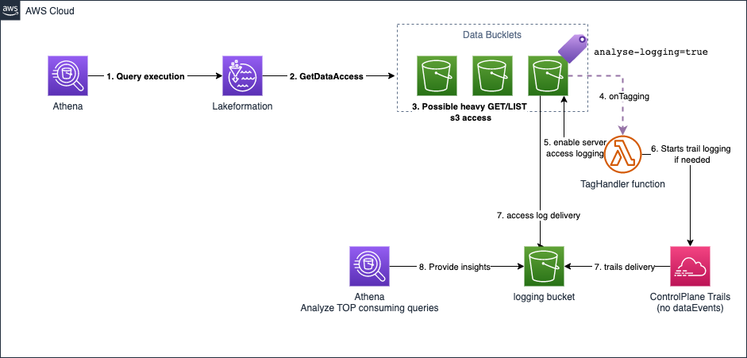

# S3 Bucket Logging with Athena Analysis

This CDK project implements S3 server access logging with automated Athena analysis to monitor how Athena queries impact S3 costs.

*Inspired by [How AWS Athena impacts S3 costs and how to monitor and improve them](https://medium.com/@guilhermenoronha2001/how-aws-athena-impacts-s3-costs-and-how-to-monitor-and-improve-them-4b9905d5b6b8)*

## 🚨 Important Warnings

- **Log Delivery Delay**: S3 server access logs have a delivery delay of **2-4 hours**. Logs are not available immediately after requests are made.
- **Cost Impact**: Enabling S3 server access logging will generate additional storage costs for the log files.
- **Data Volume**: High-traffic buckets will generate significant log volumes that may impact query performance and costs.

## Features

- **Automated Logging**: EventBridge detects `analyse-logging=true` tag and enables S3 server access logging with partitioned format
- **CloudTrail Management**: Automatically enables/disables CloudTrail logging based on bucket tagging (Lake Formation mode)
- **S3 Access Logs**: Captures all S3 requests for cost analysis with 2-4 hour delivery delay
- **Athena Integration**: Pre-configured Glue tables for querying access logs and CloudTrail events
- **Cost Monitoring**: Identifies expensive Athena queries by S3 request patterns
- **Lake Formation Support**: Correlates CloudTrail events with S3 access logs for comprehensive analysis
- **Automatic Cleanup**: Configurable lifecycle policy automatically deletes old log files (default: 30 days)

## Architecture

```mermaid
graph TB
    %% User Actions
    User[👤 User] --> |1. Tag bucket with<br/>analyse-logging=true| S3Bucket[📦 S3 Bucket<br/>Target Bucket]
    
    %% EventBridge Flow
    S3Bucket --> |2. Tag change event| EventBridge[⚡ EventBridge Rule<br/>S3TaggingRule]
    EventBridge --> |3. Trigger| Lambda[🔧 Lambda Function<br/>S3TagHandler]
    
    %% Lambda Configuration
    Lambda --> |4. Enable S3 logging<br/>with partitioned format| S3Bucket
    Lambda --> |4b. Enable CloudTrail<br/>logging (if Lake Formation)| CloudTrail
    S3Bucket --> |5. Access logs 2-4h delay| LoggingBucket[🗄️ Logging Bucket<br/>S3 Access Logs]
    
    %% Lake Formation (Optional)
    LakeFormation[🏛️ Lake Formation<br/>Data Access] -.-> |Optional: GetDataAccess events| CloudTrail[📋 CloudTrail<br/>LakeFormationTrail]
    CloudTrail -.-> |Trail logs| LoggingBucket
    
    %% Glue Database
    LoggingBucket --> |Access logs data| GlueDB[(🗃️ Glue Database<br/>s3_access_logs_db)]
    
    %% Glue Tables
    GlueDB --> S3Table[📊 S3 Access Logs Table<br/>mybucket_logs<br/>Partition Projection]
    GlueDB -.-> CloudTrailTable[📊 CloudTrail Table<br/>cloudtrail_logs<br/>Partition Projection]
    
    %% Athena Analysis
    S3Table --> |Query S3 access patterns| Athena[🔍 Amazon Athena<br/>Cost Analysis]
    CloudTrailTable -.-> |Correlate with<br/>Lake Formation events| Athena
    
    %% Results
    Athena --> Results[📈 Query Results<br/>• Top expensive queries<br/>• GET/LIST breakdown<br/>• Cost optimization insights]
    
    %% Styling
    classDef userAction fill:#e1f5fe
    classDef awsService fill:#fff3e0
    classDef storage fill:#f3e5f5
    classDef optional fill:#f1f8e9,stroke-dasharray: 5 5
    classDef results fill:#e8f5e8
    
    class User userAction
    class EventBridge,Lambda,Athena awsService
    class S3Bucket,LoggingBucket,GlueDB,S3Table storage
    class LakeFormation,CloudTrail,CloudTrailTable optional
    class Results results
```

### Architecture Overview



#### Core Components

1. **Event-Driven Automation**
   - EventBridge detects S3 bucket tagging changes
   - Lambda function automatically configures S3 access logging

2. **Data Collection**
   - S3 server access logs with partitioned format
   - Optional CloudTrail for Lake Formation correlation

3. **Data Processing**
   - Glue database with partition projection for performance
   - Separate tables for S3 logs and CloudTrail events

4. **Analysis & Insights**
   - Athena queries for cost analysis
   - Correlation between queries and S3 operations

#### Optional Lake Formation Integration

When `lakeformationEnabled=true`:
- CloudTrail captures Lake Formation data access events
- Additional Glue table for CloudTrail logs
- Enhanced correlation between Athena queries and S3 operations

### Components
- **LoggingBucket**: Stores S3 server access logs with partitioned format
- **Glue Database**: `s3_access_logs_db` with tables:
  - `mybucket_logs`: S3 access logs with partition projection
  - `cloudtrail_logs`: CloudTrail events for Lake Formation correlation (optional)
- **EventBridge Rule**: Detects S3 bucket tagging events
- **Lambda Function**: Manages S3 logging and CloudTrail configuration based on tags
- **CloudTrail**: Captures Lake Formation events for query correlation (optional, managed automatically)

### Data Flow
1. Tag S3 bucket with `analyse-logging=true`
2. EventBridge triggers Lambda function
3. Lambda enables S3 server access logging with partitioned format
4. **Lambda enables CloudTrail logging** (if Lake Formation enabled and not already logging)
5. S3 delivers access logs to logging bucket (2-4 hour delay)
6. Athena queries logs using Glue tables with partition projection

### CloudTrail Management
When Lake Formation is enabled, the Lambda function automatically manages CloudTrail logging:
- **Tagged bucket**: Enables CloudTrail logging if not already active
- **Untagged bucket**: Disables CloudTrail logging only if no other buckets have the analysis tag (uses Resource Groups API to check)

## Quick Start

### 1. Deploy
```bash
npm install
npx cdk deploy
```

**Configuration Options:**
- `lakeformationEnabled`: Enable CloudTrail integration for Lake Formation (default: false)
- `logRetention`: Duration to retain log files before automatic deletion (default: 30 days)

```typescript
// Example with custom configuration
new S3BucketLoggingAthenaStack(app, 'MyStack', {
  lakeformationEnabled: true,
  logRetention: cdk.Duration.days(90)
});
```

### 2. Enable Logging
Tag any S3 bucket with `analyse-logging=true` to automatically enable server access logging.

### 3. Wait for Logs
⏰ **Wait 2-4 hours** for the first logs to appear in the logging bucket.

### 4. Query Logs
Use the provided SQL queries in Athena to analyze your data.

## Development Commands

* `npm run build` - Compile TypeScript to JavaScript
* `npm run watch` - Watch for changes and compile
* `npm run test` - Run Jest unit tests
* `npx cdk deploy` - Deploy stack to AWS
* `npx cdk diff` - Compare deployed stack with current state
* `npx cdk synth` - Generate CloudFormation template

## SQL Queries

### Basic S3 Access Analysis

```sql
-- Top 10 Athena queries by S3 requests
SELECT
    regexp_extract(useragent, 'athenaQueryId=(.*)\"', 1) as query_id,
    sum(bytessent) as total_bytes_sent,
    sum(objectsize) as total_object_size,
    count(1) as total_requests
FROM s3_access_logs_db.mybucket_logs 
WHERE upper(operation) = 'REST.GET.OBJECT'
  AND regexp_extract(useragent, '"(AWS_ATHENA),', 1) = 'AWS_ATHENA'
GROUP BY 1
ORDER BY total_requests DESC
LIMIT 10;
```

### Lake Formation Integration

For environments using Lake Formation, this query correlates CloudTrail events with S3 access logs to provide comprehensive query analysis:

```sql
WITH cloudtrail_lakeformation_access AS (
    SELECT
        regexp_extract(
                json_extract_scalar(requestparameters, '$.auditContext.additionalAuditContext'),
                '^\{queryId: ((?:(?:[0-9a-f]+)-)+(?:[0-9a-f]+))\}$',
                1
        ) queryId,
        json_extract_scalar(additionalEventData, '$.lakeFormationRoleSessionName') lakeFormationRoleSessionName,
        eventtime,
        timestamp,
        useragent
    FROM
        cloudtrail_logs
    WHERE eventsource = 'lakeformation.amazonaws.com' AND eventname = 'GetDataAccess'
),
     s3_logs AS (
         SELECT *
         FROM mybucket_logs
         WHERE operation IN ('REST.GET.BUCKET', 'REST.GET.OBJECT')
           -- TODO : HERE PLACEHOLDERS
           AND bucket in ('a-s3-bucket')
           AND timestamp = '2026/01/07'
     )
SELECT
    lf.lakeFormationRoleSessionName,
    lf.queryid,
    lf.useragent,
    lf.eventtime request_time,
    round(sum(CASE WHEN l.operation = 'REST.GET.OBJECT' THEN l.bytessent ELSE 0 END)/1024./1024.,2) as get_bytes_sent_mb,
    round(sum(CASE WHEN l.operation = 'REST.GET.OBJECT' THEN l.objectsize ELSE 0 END)/1024./1024.,2) as get_object_size_mb,
    sum(CASE WHEN l.operation = 'REST.GET.OBJECT' THEN 1 ELSE 0 END) as get_requests,
    round(sum(CASE WHEN l.operation = 'REST.GET.BUCKET' THEN l.bytessent ELSE 0 END)/1024./1024.,2) as list_bytes_sent_mb,
    round(sum(CASE WHEN l.operation = 'REST.GET.BUCKET' THEN l.objectsize ELSE 0 END)/1024./1024.,2) as list_object_size_mb,
    sum(CASE WHEN l.operation = 'REST.GET.BUCKET' THEN 1 ELSE 0 END) as list_requests,
    round(sum(l.bytessent)/1024./1024.,2) as total_bytes_sent_mb,
    round(sum(l.objectsize)/1024./1024.,2) as total_object_size_mb,
    count(1) as total_requests
FROM
    s3_logs l
        INNER JOIN cloudtrail_lakeformation_access lf ON
        --ends_with
        starts_with(reverse(l.requester), reverse(lf.lakeFormationRoleSessionName))
            --target same partitions
            AND l.timestamp = lf.timestamp
WHERE
    -- focus only on athena queries
    queryid is not null

GROUP BY lf.lakeFormationRoleSessionName, lf.queryid, lf.useragent, lf.eventtime
ORDER BY total_requests DESC
LIMIT 10
```

## Lake Formation Support

The stack includes CloudTrail integration to support Lake Formation environments. This enables correlation between Athena query IDs and S3 access patterns.

### Example Output

The Lake Formation query provides detailed breakdown of S3 operations per Athena query:

| queryid                              | get_bytes_sent_mb | get_object_size_mb | get_requests | list_bytes_sent_mb | list_requests | total_bytes_sent_mb | total_requests |
|--------------------------------------|-------------------|--------------------|--------------|--------------------|---------------|---------------------|----------------|
| 3afe1588-2d18-4085-b108-159d1113b867 | 797.73            | 811.37             | 316          | 0.78               | 139           | 798.51              | 455            |
| 5548f802-743b-487f-bb15-75a02d30e698 | 69.63             | 70.13              | 47           | 0.25               | 341           | 69.88               | 388            |

## Troubleshooting

### No Logs Appearing
- **Check timing**: Logs have a 2-4 hour delivery delay
- **Verify tagging**: Ensure bucket has `analyse-logging=true` tag
- **Check permissions**: Lambda needs S3 logging permissions

### CloudTrail Issues (Lake Formation mode)
- **Trail not starting**: Verify Lambda has CloudTrail permissions
- **Trail not stopping**: Check if other buckets still have the analysis tag
- **Missing correlation**: Ensure CloudTrail is logging to the same bucket

### Query Performance Issues
- Use partition projection for better performance
- Filter by specific date ranges
- Consider data volume and query complexity

### High Costs
- Monitor log storage costs in the logging bucket
- Adjust log retention period using `logRetention` parameter
- Optimize query patterns to reduce S3 requests